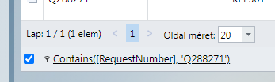
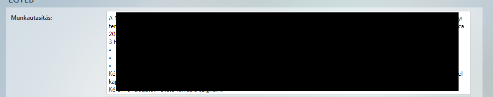
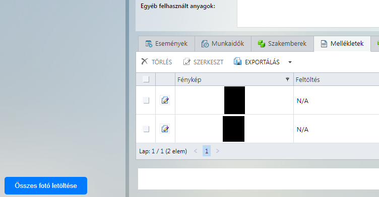

# Telepítés

A szkript a legtöbb modern böngészőre telepíthető. 

1. Telepítsd a **Tampermonkey** kiegészítőt az alábbi oldalak egyikéről:
    * [Mozilla Firefox](https://addons.mozilla.org/en-US/firefox/addon/tampermonkey/)
    * [Google Chrome](https://chromewebstore.google.com/detail/tampermonkey/dhdgffkkebhmkfjojejmpbldmpobfkfo)
    * [Microsoft Edge](https://microsoftedge.microsoft.com/addons/detail/tampermonkey/iikmkjmpaadaobahmlepeloendndfphd)
1. Most már telepítheted a szkriptet. Ehhez [kattints ide](https://github.com/MentalGravis/CMMSReportCopy/releases/latest/download/CopyTime.user.js).
1. A megjelenő oldalon kattints az **Install** gombra.
1. Lépj be a CMMSbe, és használd egészséggel.

# Funkciók

* Az oldalon megjelenített listaelemek számának menüjét balra igazítja
<picture>

</picture> 

* A munkalapon lévő rubrikák magasságát dinamikusan állítja a szöveg mennyiség alapján
    * Csak nagyjából működik, mert a betűtípus nem mono (bár gondolkodom az átállításon...)
    * Az entereket veszi figyelembe, illetve a folyamatos szöveget 130-al osztja, majd ezek összege alapján állítja át a szövegdobozt.
<picture>

</picture> 

* Képletöltés funkció
    * Csak a munkalaphoz csatolt mellékletekkel működik, és csak akkor, ha a mellékletek között a szerepel a Fénykép oszlop (Mezőválasztóval lehet betenni)
        * Igény esetén átalakítom dinamikusra, hogy ne legyen ez megkötés
    * A gomb csak akkor jelenik meg, amikor ez a Mellékletek fül aktív
    * A képeket jpg formátumban menti, a file nevek {Qszám_sorszám.jpg} formátumúak
    * Az összes képet egymás után lementi (nekem ez a funkció kellett, ha szükséges átalakítom úgy, hogy csak a kijelölt elemeket mentse)
<picture>

</picture> 

* Bugfix az oldalra görgetésnél elcsúszó elemekre
    * Egy wrapperba csomagolom a teljes oldalt, és a scrollbart kiteszem az eddigi helyére, ezáltal a túlcsordulás megszűnik jobbgomb, vagy oszlopok mozgatásakor
    * Később ezt továbbfejlesztve szeretném megcsinálni, hogy csak az egyes túlcsorduló elemek legyenek a wrapperban, minden más pedig látszódjon.
